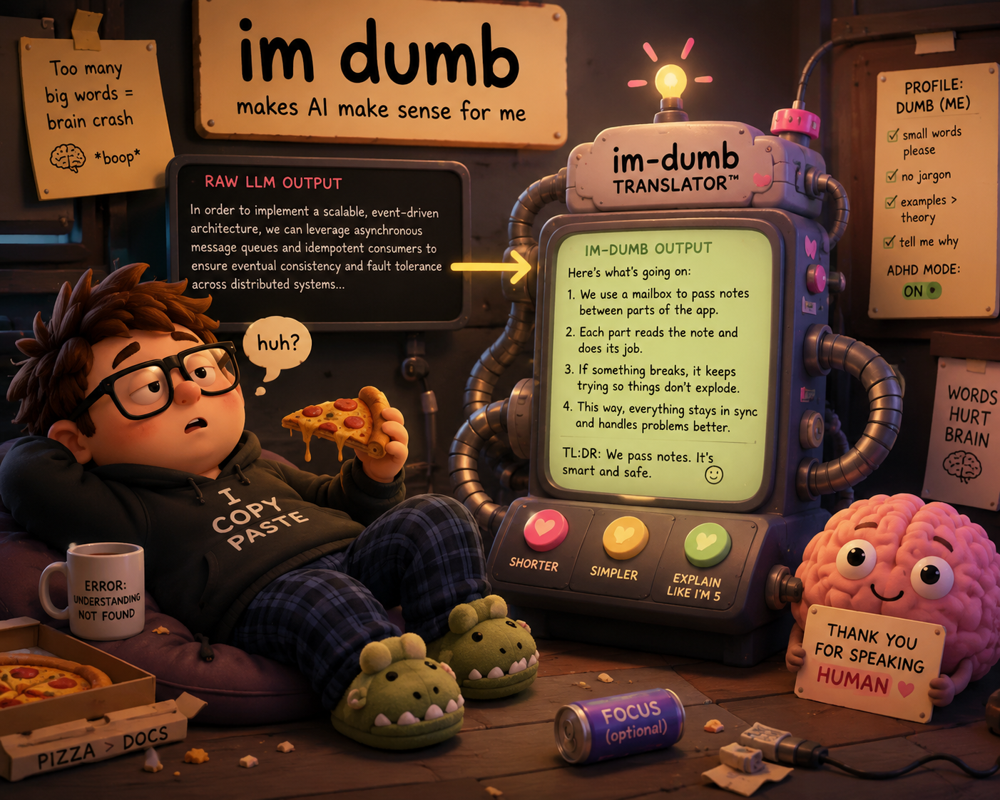

<p align="center">
  
</p>

<h1 align="center">im-dumb</h1>

<p align="center"><strong>Makes AI explain things the way your brain actually gets them.</strong></p>

<p align="center">
  
  
  
  <a href="https://github.com/Triippz/im-dumb/actions/workflows/ci.yml"></a>
</p>

AI can be technically right and still make zero sense.

You ask one question. It replies with jargon, hidden assumptions, and six paragraphs that somehow avoid the answer. **im-dumb** gives your agent a communication profile so it generates the first response with your words, structure, and tolerance for detail.

You are not dumb. The interface forgot who it was talking to.

## Contents

- [Before / after](#before--after)
- [What it changes](#what-it-changes)
- [How it works](#how-it-works)
- [Install](#install)
  - [Enhanced mode (always on, Pi only)](#enhanced-mode-always-on-pi-only)
- [Use it](#use-it)
- [Security](#security)
- [Evaluation status](#evaluation-status)
- [Development](#development)
- [What is built](#what-is-built)
- [Why “im-dumb”?](#why-im-dumb)
- [Contributing](#contributing)

## Before / after

You ask: **“How does a message queue work?”**

Without a profile:

> A message queue facilitates asynchronous, decoupled communication between distributed producers and consumers while supporting delivery guarantees and fault tolerance.

With im-dumb:

> **Answer**
>
> A message queue is a mailbox between parts of an app.
>
> **Why**
>
> One part leaves work in the mailbox. Another part picks it up when ready. If something breaks, the work can wait and try again.

The model applies the profile while generating the answer. There is no second rewrite round trip.

## What it changes

- **Vocabulary level** (`vocabulary_level`), `common` everyday words, `technical-ok` standard technical words with plain context, or `expert` established shorthand.
- **Your structure**, answer first, short sections, controlled sentence length, and examples when they help.
- **Your jargon policy**, avoid it, define it once, or allow it.
- **ADHD mode**, restructures long answers into headed chunks with no more than three sibling items. It is a communication preference, not a medical feature.
- **Comprehension repair**, when something still does not land, the skill names likely confusion points instead of asking a vague “what do you mean?”

## How it works

1. A short onboarding flow creates `~/.im-dumb/profile.json` (override the path with `IM_DUMB_PROFILE`).
2. The skill loads that profile when invoked.
3. The agent generates one profile-compliant response.
4. Deterministic offline checks catch structural regressions during development.

The same profile is designed to travel across Claude Code, Cursor, OpenAI Codex/Responses API, and Pi.

## Install

> [!IMPORTANT]
> **Pre-release:** the package is not on npm yet (`private: true` until an owner-authorized npm publication). The installer CLI is implemented in-repo, build locally, then run `node dist/install-cli.js install …`. After publish, the same entrypoint is `npx im-dumb`.

From a clone:

```bash
npm run build
node dist/install-cli.js install --targets claude,cursor,codex,pi --scope global
```

After owner-authorized npm publication:

```bash
npx im-dumb install --targets claude,cursor,codex,pi --scope global
```

| Harness | Global target | Project target |
|---|---|---|
| Claude Code | `~/.claude/skills/` | `.claude/skills/` |
| Cursor | `~/.cursor/skills/` | `.cursor/skills/` or `.agents/skills/` |
| Codex | `$CODEX_HOME/skills/` (defaults to `~/.codex/skills/`) | Not supported; Codex has no documented project skill root |
| Pi | `~/.pi/agent/skills/` or `~/.agents/skills/` | `.pi/skills/` or `.agents/skills/` |
| Claude API / claude.ai | Manual upload | n/a |
| OpenAI hosted | Manual upload or local-shell path | n/a |

Hosted upload automation is intentionally out of scope for v1 because it would require account credentials.

### Enhanced mode (always on, Pi only)

Installing the skill copies files into a skill root. That makes the skill *available*, not *active*: every harness loads a skill only when the model decides the request matches its description, so on a plain question it may never load at all.

Pi is the one harness that can keep it on for a whole session. Install the package rather than copying the skill directory:

```bash
pi install git:github.com/Triippz/im-dumb
```

That registers `pi.extensions`, which appends your active profile to the system prompt on every turn, so the rules cannot drift as a conversation grows. Nothing is set per session and nothing expires.

Enhanced mode is optional. The skill works on every harness without it, and a missing or unreadable profile adds nothing rather than failing the turn. Claude Code, Cursor, and Codex get a weaker session-hook form later: their hooks run before generation, so they are the same class as prompt text.

## Use it

Installing changes nothing on its own. The skill applies a profile, and a fresh machine has no profile, so answers come back in the model's normal voice until you create one.

**1. Create the profile.** Ask the agent to `set up im-dumb`. It walks one question at a time and writes `~/.im-dumb/profile.json`. Check it landed:

```bash
node ~/.claude/skills/im-dumb/scripts/profile.js load
```

That prints the profile as JSON, or `{"error":"missing"}` if onboarding never ran. Swap the path for whichever skill root you installed into.

Any of these also work as triggers: `view my im-dumb profile`, `change my im-dumb profile`, `im-dumb`.

**2. Confirm it is applying.** Ask a question in a domain you do not know. A working profile shows up as shorter sentences, defined jargon, and answer-first structure. If replies look unchanged, the usual cause is one of: no profile yet, the skill never loaded on that turn, or you are on a harness without enhanced mode.

**Check whether it is actually applying.** The harnesses already write every session to disk, so this needs no proxy and no daemon:

```bash
npm run report:sessions
```

That runs the same deterministic checkers CI uses over the assistant turns in your Claude Code, Codex, and Pi session logs, and prints how many turns broke the profile and which rule they broke. Counts cover every turn in the log, including turns where the skill never loaded, so treat the rate as a floor rather than a verdict on the skill. Cursor is absent because it routes model traffic through its own backend and writes no comparable local usage record.

**3. Teach it.** When an answer loses you, say so plainly (`huh`, `I don't understand`). The skill names its best guesses at what confused you and asks one question, rather than repeating the same explanation louder. Confirm when a repair works and it records the gap for later answers.

Point at a different profile file with `IM_DUMB_PROFILE`:

```bash
IM_DUMB_PROFILE=/path/to/profile.json
```

That is useful for a work profile and a personal profile on one machine, and for testing a profile without touching your real one.

## Security

- Bundled skill scripts make **no outbound network calls** at invocation time.
- Compiled JavaScript has **zero runtime dependencies**.
- Running `npx im-dumb` (after owner-authorized npm publication) will need network access once, to download the package; after install, the skill's bundled scripts still make no outbound network calls when invoked. Local `node dist/install-cli.js` needs no network.
- The installer only writes local files that you can inspect.
- Profile paths can be overridden with `IM_DUMB_PROFILE`; profile validation rejects unknown fields on save.

## Evaluation status

The profile module and CLI, deterministic checkers, the golden dataset, and the judge rubric are in place, alongside 54 manually captured baseline/candidate responses and two evidence reports:

- [Token-overhead report](eval/baselines/m1-token-overhead-report.md), single-trial; corpus aggregate is **-12.56%** against the report-only ceilings, but three individual cases exceed the +60% per-case ceiling.
- [Live spot-check report](eval/baselines/m1-live-spot-check.md), **0 of 5** golden cases passed the full judge rubric in a single-trial, manual run.

Both reports are single-trial and report-only: they are recorded risk, not blocking gates, and not ground truth. This evidence is not a production-readiness signal. Model-scored behavior only gates a release once the multi-trial, variance-aware evaluation runner runs live, which needs judge credentials and is off by default.

How the full stack fits together (Layer 1 checkers, golden dataset, rubrics, comprehension-gate runtime evidence) and why those gates are shaped the way they are: [eval/README.md](eval/README.md).

## Development

Requires Node.js 24.12 or newer for stable TypeScript type stripping.

```bash
npm install
npm run build
npm run typecheck
npm test
```

The project uses strict TypeScript, Node’s built-in test runner, Conventional Commit PR titles, and deterministic evaluation fixtures before behavior ships.

## What is built

- **Profile and language rules:** profile schema and CLI, deterministic checkers, golden dataset, captured evidence (see [evaluation status](#evaluation-status)). Prose gates stay report-only.
- **Comprehension gate:** confusion diagnosis with named candidates, learned gaps. Runtime acceptance is still open: captures are per-model evidence, not a merge gate.
- **Evaluation stack:** offline smoke runner, report-only token-overhead signal, nightly warn job.
- **Packaging:** multi-harness installer CLI, unpublished until an owner-authorized npm run.
- **Learning assets:** markdown and HTML explainers, HTML slide decks. Audio and video are out of scope; a host integration calling an external generator is a stretch goal.
- **Release and governance:** manual `workflow_dispatch` release, SemVer derived from commit history, changelog generation. No package published yet.

## Why “im-dumb”?

Because “the explanation did not fit me” often gets treated as “I am the problem.” The name makes fun of that failure mode, not the person asking for clarity.

## Contributing

Read [AGENTS.md](AGENTS.md) before changing behavior. Keep PR titles conventional and CI green before merge.
